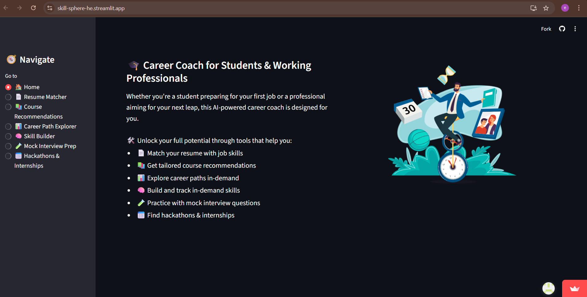

# 🎯 Black and White - Skill Sphere App

**Black and White** is a multi-feature, intelligent career coaching web app built using **Streamlit** and powered by **Microsoft Azure AI services**. It helps students and early professionals bridge the gap between their academic profile and real-world job market expectations. The name reflects the clarity the app aims to provide—clear guidance with no grey areas.

## 🚀 Features

### 🧾 Resume Matcher
- Parses uploaded resumes using **Azure Document Intelligence**
- Extracts skills and compares them with in-demand industry skills
- Displays match percentage, missing skills, and improvement areas

### 🌐 Global Insights
- Interactive map built with **Streamlit + Folium**
- Uses **Azure Maps** to highlight job POIs by region
- Helps users identify countries where their skills are in demand

### 📚 Course Recommendations
- Users enter any keyword (e.g., "Flutter", "Cybersecurity")
- Uses a deployed **Azure Machine Learning model** to fetch top 10 relevant courses
- Provides direct links to upskill immediately

### 🧭 Career Path Explorer
- Enter a dream career (e.g., "AI Engineer")
- Uses **Azure OpenAI** to generate:
  - Required skills
  - Certifications
  - Job roles
  - Career roadmap (beginner to expert)

### 🛠️ Skill Builder
- Parses the resume and analyzes strengths, weaknesses, and skill gaps
- Suggests improvements using **Azure OpenAI**

### 🧪 Mock Interview
- Practice technical or behavioral questions
- Timer for each question
- Scores answers out of 10 with real-time feedback using **Azure OpenAI**

### 🏁 Hackathons & Internships
- Users input location or select from map
- Displays upcoming hackathons to join

### 📈 Industry Trends
- Pulls in real-time data on emerging tools, languages, and hiring demands
- Keeps users updated with current industry trends

---

## 🧪 Demo

### ▶️ **Live App**
👉 **Live Demo:** [Click here to run the project](https://skill-sphere-he.streamlit.app/)

---

### 📸 Project Screenshot

_Above is a screenshot of the project in action._

---
